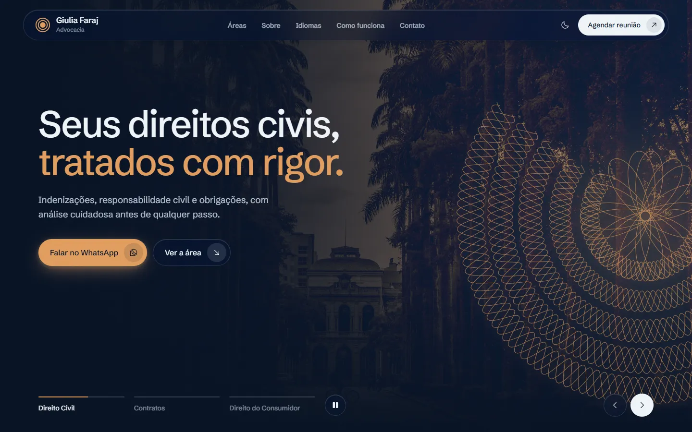
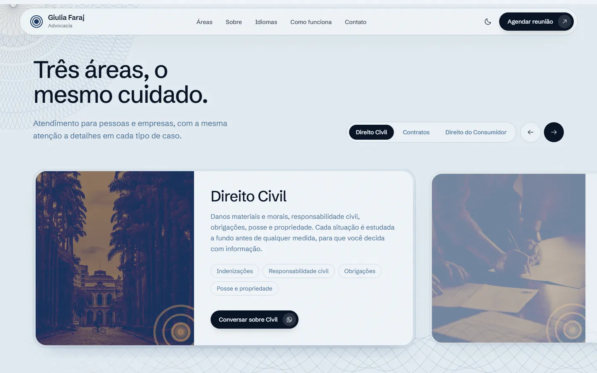
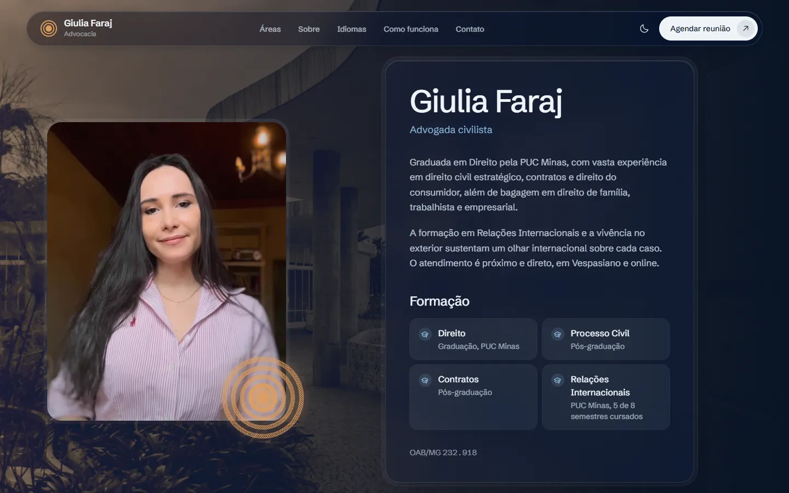

<div align="center">

# Giulia Faraj Advocacia

**Site institucional para uma advogada civilista: direção de arte, design de interface e desenvolvimento front-end.**

[](https://giuliafarajadv.vercel.app)
[](https://giuliafarajadv.vercel.app)
[](#o-projeto)

[](https://react.dev)
[](https://vite.dev)
[](https://tailwindcss.com)
[](https://gsap.com)
[](https://lenis.darkroom.engineering)
[](https://culorijs.org)
[](#acessibilidade-e-performance)
[](#galeria)

### [giuliafarajadv.vercel.app](https://giuliafarajadv.vercel.app)



</div>

---

## O projeto

Giulia Faraj é advogada civilista em Belo Horizonte e região, com atuação em Direito Civil, Contratos e Direito do Consumidor e perfil internacional: formação em Relações Internacionais e intercâmbios na França e no Canadá. Ela precisava de um site que transmitisse confiança e rigor, sem a cara genérica de "escritório de advocacia", e que levasse o visitante ao primeiro contato.

**Objetivo:** captação. Cada seção aponta para um próximo passo claro: conversar pelo WhatsApp ou enviar um e-mail já preenchido.

**Escopo:** briefing, direção visual, sistema de design, desenvolvimento, conteúdo e publicação.

**Restrições:** publicidade dentro do Provimento OAB 205/2021 (sem promessa de resultado, sem captação mercantilista), LGPD no formulário e foco total na profissional, sem menção a escritórios anteriores.

## Direção visual: guilhoché

As linhas finas da **impressão de segurança** (diplomas, carteira da OAB, passaportes) viram a linguagem do site. Elas são o símbolo visual de autenticidade e confiança, e conversam com o perfil internacional da cliente.

- **Rosetas e faixas de guilhoché** geradas por código (senoides polares e hipotrocoides em SVG), que se desenham e brilham.
- **Paleta azul e marrom** pedida pela cliente: campo noturno azul-tinta, "papel de segurança" azul-pálido nas seções claras, nogueira como segundo campo e **cognac como a única luz**, reservada para onde o visitante deve agir.
- **Fotos em duotone** feitas com blend modes, com sombras em azul-tinta e luzes em nogueira clara.
- **Vidro fosco em moldura dupla**, botões em pílula com ícone aninhado e tipografia Schibsted Grotesk em escala forte.

| Token | Papel |
|---|---|
|  | Campo escuro (hero, sobre, contato) |
|  | Âncora da marca, títulos sobre claro |
|  | Papel de segurança (seções claras) |
|  | Campo nogueira (Como funciona) |
|  | A única luz: chamadas para ação e brilhos |

## Destaques

- **Hero em carrossel de 3 banners**, um por área de atuação, com barra de progresso, pausa, setas, swipe e teclado. Pausa sozinho fora da tela e com foco de teclado.
- **Roseta de guilhoché** que se redesenha a cada troca de banner, com parallax em camadas ao rolar.
- **"Clareza"** em contorno gigante, preenchida pelo scroll.
- **Áreas de atuação** em trilho de cartões com scroll-snap, setas e abas, sem prender o scroll da página.
- **"Como funciona"**: uma única linha de guilhoché desenhada pelo scroll liga os quatro passos.
- **Contato sem backend:** "Falar no WhatsApp" abre a conversa com mensagem pronta. "Enviar mensagem" monta o e-mail completo (assunto, resumo, contatos e consentimento LGPD) no aplicativo do visitante, com opções de Gmail e de copiar o texto.
- **Tema claro e escuro**, com a preferência do sistema como padrão.

## Galeria

| Áreas de atuação | Sobre |
|---|---|
|  |  |
| **Contato** | **Mobile** |
|  |  |

## Decisões técnicas

- **Paleta gerada por código.** As cores nascem de sementes OKLCH em [`scripts/palette.mjs`](scripts/palette.mjs). O script usa a biblioteca culori para ajustar a luminosidade dos textos até passar no contraste WCAG AA (12 pares checados) e gera [`src/styles/palette.css`](src/styles/palette.css).
- **Tokens em tudo.** Cores, raios, sombras, durações e curvas vivem no `@theme` do Tailwind 4. O sistema está documentado em [`DESIGN.md`](DESIGN.md).
- **Uma linguagem de movimento:** ease-out `cubic-bezier(0.23, 1, 0.32, 1)`, UI de 160 a 240 ms e revelações de 700 ms. GSAP + ScrollTrigger cuidam da coreografia de scroll e Lenis do scroll suave sincronizado.
- **Guilhoché procedural** em [`src/lib/guilloche.js`](src/lib/guilloche.js): cada área tem uma roseta com parâmetros próprios.
- **Imagens leves:** WebP em dois tamanhos com `srcset`, fotos já em tons de cinza (o duotone é aplicado no CSS) e fonte auto-hospedada.
- **Conteúdo centralizado** em [`src/content.js`](src/content.js), para editar textos sem tocar nos componentes.

## Acessibilidade e performance

- Contraste AA em todos os pares de texto, inclusive sobre fotos e fundos animados.
- `prefers-reduced-motion`: sem autoplay, parallax, desenho de linhas ou scroll suave.
- HTML semântico, link "pular para o conteúdo", foco visível no tom da marca, rótulos e erros de formulário anunciados.
- Verificado em 375, 768 e 1440 px, nos temas claro e escuro: sem erros de console e sem rolagem horizontal.
- SEO local com meta tags e dados estruturados `LegalService`.

## Stack

| Camada | Ferramenta |
|---|---|
| Interface | React 19 |
| Build | Vite 8 |
| Estilo | Tailwind CSS 4 (tokens em `@theme`) |
| Movimento | GSAP + ScrollTrigger (`@gsap/react`), Lenis |
| Cor | culori (desenvolvimento) |
| Ícones | Phosphor Icons |
| Fonte | Schibsted Grotesk (`@fontsource-variable`) |
| Deploy | Vercel |

## Rodando localmente

```bash
npm install
npm run dev       # servidor de desenvolvimento
npm run build     # build de produção em dist/
npm run lint      # oxlint
npm run palette   # regenera a paleta e confere o contraste
```

## Estrutura

```
src/
  components/   Header, Hero, Intro, Areas, About, Process, Contact, Footer
  lib/          guilloche (geradores SVG), motion (GSAP + Lenis), theme, useInView
  styles/       palette.css (gerado)
  content.js    textos, contatos e dados das áreas
scripts/        palette.mjs (cores + contraste)
docs/           imagens deste README
PRODUCT.md      contexto do produto e restrições
DESIGN.md       sistema de design documentado
```

## Créditos

- **Cliente:** Giulia Faraj, advogada (OAB/MG 232.918).
- **Design e desenvolvimento:** [Maicon Vitor](https://github.com/MaiconVts).
- **Fotos de apoio:** Unsplash (Thay Pellerin, Romain Dancre, Mathias Reding, Nathalia Segato), licença Unsplash. Retrato cedido pela cliente.

---

<div align="center">

**Status:** concluído e publicado em [giuliafarajadv.vercel.app](https://giuliafarajadv.vercel.app)

</div>
